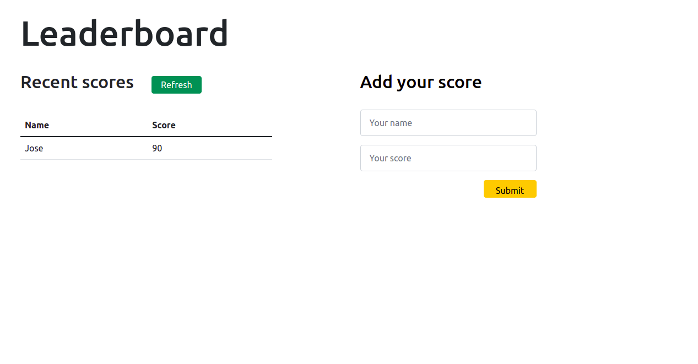

# Leaderboard - Jose Abel Ramirez Frontany

Leaderboard project where I've built a basic frontend with HTML, CSS and JavaScript to consume the API https://us-central1-js-capstone-backend.cloudfunctions.net/api/ where I first create a game through Postman and after create a basic UI that with asynchronous code sends a POST request through the submit button of the "Add your score" form, and sends a GET request through the "refresh" button in the recent scores table.



## Built With

- HTML
- CSS
- JavaScript
- Webpack
- Babel plugin-transform-modules-commonjs

## Getting Started

To get a local copy up and running follow these simple example steps.

### Setup

Go to the top of the page, press te green button that says "Code", and copy the link. Then you have to go to your console and type

```
    git clone 'repository-link'
```

That's all, you are ready to go!

### Install

Run the following command to have all npm packages dependencies installed:

```
    npm install
```

### Usage

To start the webpack-dev-server, run the following command:

```
    npm start
```

### Live Demo Server

<!-- - [live-version with github pages]() -->

### Tests

Javascript linters

```
    npx eslint .
```

HTML linters

```
    npx hint .

```

CSS linters

```
    npx stylelint "**/*.{css,scss}"
```

## Author: Jose Abel Ramirez Frontany\*\*

- GitHub: [Jose Abel Ramirez Frontany](https://github.com/jose-Abel)
- Linkedin: [Jose Abel Ramirez Frontany](https://www.linkedin.com/in/jose-abel-r-7674a842/)

## 🤝 Contributing

Contributions, issues, and feature requests are welcome!

## 📝 License

This project is MIT licensed.

## Show your support

Give a ⭐️ if you like this project!
